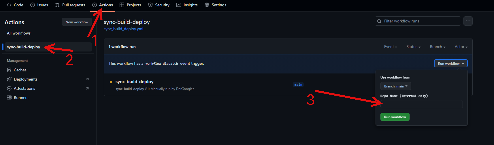

[MMRL]: https://github.com/DerGoogler/MMRL

# Magisk Modules Alt Repo

This repository stores modules for [MMRL].

To submit your modules, please go to the [submission](https://github.com/Magisk-Modules-Alt-Repo/submission) repository.

## Add to MMRL

```
https://magisk-modules-alt-repo.github.io/json-v2/
```

## Add to MMRL-CLI

```shell
mmrl repo add "https://magisk-modules-alt-repo.github.io/json-v2/json/modules.json"
```

## Advanced Online Metadata

Please check the [`repo.json`](https://github.com/DerGoogler/MMRL/blob/master/docs/REPO-JSON.md) documentation at the [MMRL] repository

## How to update?

- [magisk-modules-repo-util](https://github.com/Googlers-Repo/magisk-modules-repo-util.git)

### For mods

1. Go to actions
2. Click on "sync-build-deploy"
3. Click on "Run workflow" and enter a repo that has been added to the **Magisk Modules Alt Repo**
4. Wait till the action has ended


